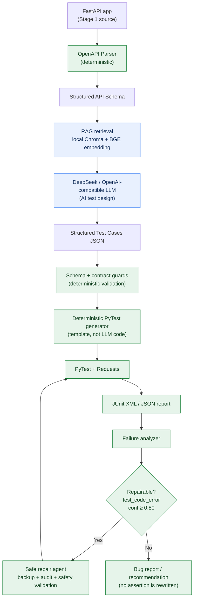

# AI Agent Automated Testing Platform

[](https://github.com/OWNER/ai-testing-agent/actions/workflows/tests.yml)

> An AI-assisted API testing platform that converts OpenAPI specifications into
> structured test cases, executable PyTest scripts, JUnit / JSON reports, and a
> **controlled** failure-repair loop.

The LLM designs tests; deterministic templates and deterministic safety guards turn
them into runnable, auditable code. The agent can never "fix" a red build by deleting
tests or weakening assertions.

---

## Architecture



- **AI decisions (blue):** RAG-enhanced test design; failure classification / repair suggestion.
- **Deterministic (green):** OpenAPI parsing, contract validation, PyTest generation,
  execution, reporting, and all safety validation.

---

## Key Features

- OpenAPI automatic parsing (FastAPI app → structured schema)
- RAG-enhanced test design (local Chroma vector store, BGE Chinese embedding, no external vector DB)
- Real DeepSeek (OpenAI-compatible) integration with structured JSON output
- Deterministic schema + **contract guards** that reject invalid LLM cases before codegen
- Deterministic PyTest/Requests generation (the LLM never writes Python directly)
- Automated execution with JUnit XML and JSON reports
- Failure classification into 5 categories
- Controlled repair: admission gate, file backup, append-only audit log, compile + safety checks
- Anti-gaming guardrails (cannot delete tests, drop asserts, or use skip/xfail)
- Runs as a normal installable Python package; Windows and Ubuntu CI compatible

---

## Verified Results

All numbers below come from real runs in this repository (Python 3.13, local venv);
they are not estimates.

| Item | Result |
|---|---|
| Regression tests | **89 / 89 PASS** (0 failed, 0 skipped) |
| Stage 4 API E2E (`demo_run_tests`) | **PASS** (11/11) |
| Stage 5 controlled-repair E2E (`demo_agent_pipeline`) | **PASS** (real-LLM repair; mock fallback also PASS without an API key) |
| Real DeepSeek E2E (`demo_real_llm_pipeline`) | **PASS** — 12 generated, **12/12 executed PASS** |
| RAG used in real E2E | **Yes** (retrieval from local Chroma before every LLM call) |
| Failure categories | **5** (`test_code_error`, `api_defect`, `test_data_error`, `environment_error`, `unknown`) |
| Max repair attempts | **2** (default 1) |
| Repair confidence threshold | **0.80** |
| HTTP methods demonstrated by the demo app | **GET, POST** (parser is method-agnostic) |

> The deterministic contract guard (`find_contract_conflicts`) rejects objectively invalid
> LLM cases — e.g. a "401 wrong credentials" case that sends a 140-char password against a
> `maxLength: 128` schema (that request can only return 422). During development the guard
> repeatedly caught exactly this LLM mistake; the final verified run produced 12 self-consistent
> cases and rejected 0.

CI never calls the real LLM. The Real DeepSeek result above is produced separately by the
manual command in [Real LLM E2E](#real-llm-e2e-optional-paid).

---

## Quick Start

```bash
# 1. clone & enter
git clone <your-repo-url> ai-testing-agent
cd ai-testing-agent

# 2. virtual environment
python -m venv .venv
# Windows:
.venv\Scripts\activate
# Linux / macOS:
source .venv/bin/activate

# 3. install pinned dependencies and the package (editable)
pip install -r requirements.txt
pip install -e .

# 4. optional: configure a real DeepSeek / OpenAI-compatible key
cp .env.example .env        # Windows: copy .env.example .env
# edit .env and set OPENAI_API_KEY / OPENAI_BASE_URL / MODEL_NAME

# 5. run the deterministic + mocked regression (no API key needed)
pytest
```

On Windows, give pytest a writable temp dir:

```bash
pytest --basetemp=.pytest_tmp
```

---

## Five-Stage Pipeline

| Stage | Input → Output | Module |
|---|---|---|
| 1 | FastAPI source → OpenAPI → structured schema | `api_schema_parser.py` |
| 2 | Schema → **RAG + DeepSeek** → structured cases JSON | `test_case_generator.py`, `rag_knowledge_base.py` |
| 3 | Cases JSON → deterministic PyTest code | `test_code_generator.py` |
| 4 | PyTest → execution → JUnit XML / JSON report | `test_runner.py`, `demos/demo_target_app.py` |
| 5 | Failure → analyze → safe repair → re-run | `failure_analyzer.py`, `safe_test_repair.py`, `agent_orchestrator.py` |

Shared configuration and the demo-server lifecycle live in `config.py`;
`run_ai_testing_pipeline.py` orchestrates all five stages.

### Running the demos

```bash
# Stage 4: FastAPI -> PyTest -> JUnit/JSON (no LLM)
python -m ai_testing_agent.demos.demo_run_tests

# Stage 5: failing test -> analyze -> backup -> safe repair -> re-run PASS
# Uses the real LLM if OPENAI_API_KEY is set, otherwise a clearly-labelled deterministic mock
python -m ai_testing_agent.demos.demo_agent_pipeline

# All five stages over every demo endpoint (real LLM)
python -m ai_testing_agent.run_ai_testing_pipeline
```

### Real LLM E2E (optional, paid)

Requires a valid key in `.env`. This is the only flow that calls the real model, and it is
**not** run in CI (cost, network, LLM non-determinism):

```bash
python -m ai_testing_agent.demos.demo_real_llm_pipeline
```

Without a key it prints exactly:

```
REAL_LLM_E2E = NOT RUN
Reason: OPENAI_API_KEY unavailable
```

and writes a `NOT_RUN` report. It never fabricates a PASS and never prints the key.
The verified report is at `reports/real_llm_e2e_report.json`.

---

## Safety Design

Repair is deliberately narrow. `safe_test_repair.py` enforces:

1. Repairable only when `category == "test_code_error"` **and** `confidence ≥ 0.80`
   **and** `repair_allowed == true`.
2. Files under `generated_tests/` are the **only** writable target; business/source modules
   are never touched.
3. Every repair is preceded by a file backup and followed by an append-only `audit.jsonl` entry.
4. Repaired code must `compile()` and keep the **same number (or more) of `test_` functions**
   and the **same number (or more) of assertions**.
5. Forbidden calls are rejected: `os.system`, `os.popen`, `subprocess.*`, `shutil.rmtree`,
   `eval`, `exec`, `__import__`.
6. `pytest.skip` / `skipif` / `xfail` are rejected — a green build cannot be faked.
7. Max repair attempts: default **1**, hard cap **2**.

When a failure is an API-behavior or test-data disagreement rather than a code error, the
analyzer emits a bug report/recommendation and **does not rewrite the assertion** — so a
genuine product defect can never be auto-painted green.

---

## Project Structure

```
ai-testing-agent/
├── ai_testing_agent/
│   ├── __init__.py
│   ├── config.py                  # env, constants, logging, demo-server lifecycle
│   ├── api_schema_parser.py       # Stage 1
│   ├── test_case_generator.py     # Stage 2 (RAG + LLM + validators/guards)
│   ├── rag_knowledge_base.py      # Chroma build script
│   ├── test_code_generator.py     # Stage 3 (deterministic templates)
│   ├── test_runner.py             # Stage 4
│   ├── failure_analyzer.py        # Stage 5
│   ├── safe_test_repair.py        # Stage 5 safety core
│   ├── agent_orchestrator.py      # Stage 5 loop
│   ├── run_ai_testing_pipeline.py # all-stage orchestrator
│   └── demos/
│       ├── demo_target_app.py
│       ├── demo_run_tests.py
│       ├── demo_agent_pipeline.py
│       └── demo_real_llm_pipeline.py
├── tests/                         # 89 deterministic/mocked regression tests
├── generated_tests/               # generated PyTest (target of repairs)
├── reports/                       # example JUnit/JSON/agent/real-LLM reports
├── docs/                          # RAG knowledge source (testing standard)
├── chroma_db/                     # persisted local vector store
├── .github/workflows/tests.yml    # Ubuntu CI, no real LLM
├── requirements.txt
├── pyproject.toml
├── .env.example
└── PROJECT_METRICS.md
```

---

## Testing

```bash
# full suite (7 files, 89 tests), no API key
pytest tests/ --basetemp=.pytest_tmp
```

Per-stage files:

```
tests/test_api_schema_parser.py          # Stage 1
tests/test_api_test_case_generator.py    # Stage 2 (LLM mocked, incl. contract-guard tests)
tests/test_test_code_generator.py        # Stage 3
tests/test_test_runner.py                # Stage 4
tests/test_failure_analyzer.py           # Stage 5
tests/test_safe_test_repair.py           # Stage 5 anti-gaming safety
tests/test_agent_orchestrator.py         # Stage 5 loop
```

CI (`.github/workflows/tests.yml`) runs on Ubuntu for every push/PR with an empty
`OPENAI_API_KEY`; Stage 2/5 LLM paths are exercised through mocks only.

---

## Known Limitations (honest)

- **LLM non-determinism.** Real-LLM runs vary (e.g. 11 vs 12 cases). The deterministic
  contract guard catches provably invalid cases; other genuine behavior disagreements are
  reported for human review rather than forced green.
- The all-interface orchestrator (`run_ai_testing_pipeline`) is exploratory over real LLM
  output. For the minimal demo app, LLM-assumed constraints that are **not** in the schema
  (e.g. positive/int32 `user_id`) correctly surface as failures the agent declines to "fix".
  The three curated demo E2E flows are the reproducible, fully-green acceptance paths.
- First run downloads the BGE embedding model from Hugging Face (cached afterwards).
- Embeddings/RAG run on CPU by default.

---

## Tech Stack

Python 3.13 · FastAPI · Pydantic v2 · Uvicorn · Requests · PyTest ·
DeepSeek (OpenAI-compatible) · LangChain + langchain-chroma + langchain-huggingface ·
ChromaDB · sentence-transformers (BGE)

## License

MIT
